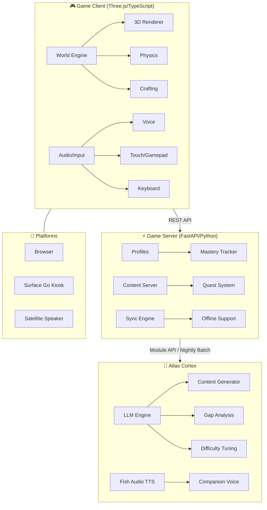

# Project Athena — Nexus Academy

> *"The OASIS school from Ready Player One, but real."*

An open-world adaptive learning game for ages 2–24. No quizzes. No tests. No essays.
The world demands knowledge and rewards mastery. Playing IS learning.

Powered by [Atlas Cortex](https://github.com/Betanu701/atlas-cortex). Built by
[Digital Brainstem](https://github.com/Digitalbrainstem).

---

## Architecture



## The Game

Five age tiers, one seamless world that grows with the player:

| Tier | Ages | Experience |
|------|------|-----------|
| **Little Learner** | 2–5 | Dora-style companion talks directly to the child. Touch + voice. Colors, counting, shapes, phonics. |
| **Explorer** | 6–10 | Open world unlocks. Companion becomes adventure partner. Quests teach arithmetic through calculus foundations. |
| **Adventurer** | 11–14 | Full crafting, Code Forge, Time Rift missions. Real chemistry formulas, structural physics, economy systems. |
| **Scholar** | 15–18 | Physics simulations, chemistry labs, historical debates. AP/college-prep level content. |
| **Master** | 18–24 | Research-grade tools. Calc 3, organic chemistry, quantum mechanics, ML, distributed systems. |

**Knowledge is the only currency.** No microtransactions. No ads. No pay-to-play. Ever.

## Documentation

20 focused spec documents in [`docs/`](docs/README.md):

| # | Document | Focus |
|---|----------|-------|
| 01 | [Vision](docs/01-VISION.md) | Design pillars, inspirations, what this IS and ISN'T |
| 02 | [World Design](docs/02-WORLD_DESIGN.md) | Biomes, morphing, procedural generation |
| 03 | [Travel Mechanics](docs/03-TRAVEL_MECHANICS.md) | Village → galaxy, ships, FTL, fuel chemistry |
| 04 | [Age Tiers](docs/04-AGE_TIERS.md) | Little Learner through Master — detailed gameplay |
| 05 | [Gameplay Loops](docs/05-GAMEPLAY_LOOPS.md) | Quests, crafting, building, Code Forge, economy |
| 06 | [Mastery System](docs/06-MASTERY_SYSTEM.md) | Ender Protocol: spaced repetition, gap detection |
| 07 | [Subject Mapping](docs/07-SUBJECT_MAPPING.md) | Every subject → game mechanic, all tiers |
| 08 | [Atlas Integration](docs/08-ATLAS_INTEGRATION.md) | Invisible architect, nightly batch |
| 09 | [Content Pipeline](docs/09-CONTENT_PIPELINE.md) | Generation, validation, caching, distribution |
| 10 | [Story & Narrative](docs/10-STORY_NARRATIVE.md) | The Founders, mystery arc, endgame |
| 11 | [Companion System](docs/11-COMPANION_SYSTEM.md) | Character arc, personality, teaching |
| 12 | [Voice Gameplay](docs/12-VOICE_GAMEPLAY.md) | Zero-screen satellite mode |
| 13 | [Input & Controls](docs/13-INPUT_CONTROLS.md) | Touch, voice, keyboard, gamepad |
| 14 | [Multiplayer](docs/14-MULTIPLAYER.md) | Co-op, classroom mode, child safety |
| 15 | [Profiles](docs/15-PROFILES_PROGRESSION.md) | Calibration zone, sync, progression |
| 16 | [Art Direction](docs/16-ART_DIRECTION.md) | Stylized 3D, per-tier visual style |
| 17 | [Audio Design](docs/17-AUDIO_DESIGN.md) | TTS, adaptive music, spatial audio |
| 18 | [Tech Architecture](docs/18-TECHNICAL_ARCHITECTURE.md) | Three.js, FastAPI, DB, offline |
| 19 | [Accessibility](docs/19-ACCESSIBILITY.md) | Visual, motor, cognitive, auditory |
| 20 | [Screen Time](docs/20-SCREEN_TIME_SAFETY.md) | Parental controls, COPPA, safety |

Also: [Copilot Instructions](.github/copilot-instructions.md) — AI assistant context for development.

## Getting Started

### Prerequisites

- Node.js 18+ (client)
- Python 3.11+ (server)
- Atlas Cortex instance (optional — game runs standalone)

### Development

```bash
# Clone
git clone https://github.com/Digitalbrainstem/athena.git
cd athena

# Client (not yet implemented)
cd client && npm install && npm run dev

# Server (not yet implemented)
cd server && pip install -r requirements.txt && python -m server.app
```

### Satellite Audio-Only Mode

The game runs on Atlas satellite speakers (Hermes) with zero screen — pure voice
interaction. See [Voice Gameplay](docs/VOICE_GAMEPLAY.md) for the full design.

## Design Principles

1. **Learning IS gameplay** — the world demands knowledge, not answers to questions
2. **The game runs standalone** — Atlas is the architect, not the engine
3. **No microtransactions** — knowledge is the only currency
4. **Never feels like school** — no grades, no scores, the world simply responds
5. **Radians AND degrees from age 2** — angles as "turns" builds lifelong intuition
6. **Gender-neutral everything** — interests tracked by behavior, never demographics
7. **Screen time is unlimited** — parent-configurable, never punitive
8. **The companion grows up with you** — from Dora-style friend to research partner

## Atlas Ecosystem

| Codename | Project |
|----------|---------|
| **Atlas** (Cortex) | Self-evolving personal AI |
| **Athena** | Nexus Academy — this game |
| **Apollo** | ContextForge — context window manager |
| **Hermes** | Satellite speakers (Pi/ESP32) |
| **Iris** | Computer vision system |

## License

[MIT](LICENSE) — © 2026 Digital Brainstem / Derek Thomas
